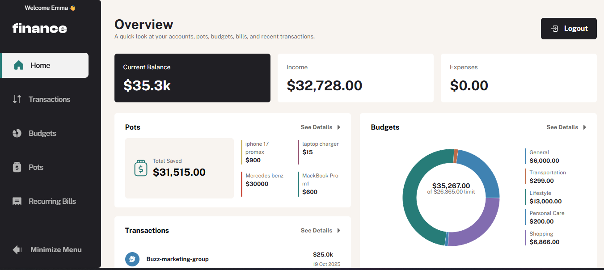

# Personal Finance Snapshot

## Overview

This project is a **personal finance tracking application** that helps users monitor their income, expenses, and spending patterns.

The application allows users to record transactions, categorize them, and visualize their finances through charts and summaries. The focus of the project is **simplicity, clarity, and smooth user interaction** so users can quickly understand where their money is going.

I originally built this project as a personal finance tracker and refined for this assessment.

---

## Live Demo

**Live Application:**
https://personal-finance-app-2zd7.vercel.app/

## Preview

### Dashboard



### Add Transaction


### Budget Management


---

## Features

- Add new transactions (name, amount, category, avatar)
- Track income and expenses
- Categorize transactions
- Visualize spending with charts
- Basic budget tracking
- Create & manage pots
- Persistent data storage
- Clean and intuitive UI

---

## Assessment Requirements

The project was built to match the core expectations of the take-home assessment.

- [x] Display income and expenses across categories
- [x] Add new transactions
- [x] Spending visualization
- [x] Budget tracking
- [x] Persistent data storage

---

## Tech Stack

- **Next.js**
- **React**
- **Tailwind CSS**
- **Supabase**
- **Recharts (Chart library) for financial visualization**

---

## Design & Implementation Choices

The application focuses on **clarity and ease of use**. Financial data should be easy to read, understand, and update quickly.

Some key decisions:

- A **minimal UI** to reduce cognitive load
- **Visual charts** to make spending patterns easier to understand
- **Component-based architecture** for maintainability
- Simple interaction flow for adding transactions quickly

Although the application uses Supabase for persistence, the core functionality behaves like a lightweight frontend finance tracker.

---

## Challenges

A key challenge was structuring transaction data in a way that makes it easy to:

- Categorize transactions
- Calculate totals efficiently
- Update visualizations dynamically

This was handled by separating data handling logic from UI components and organizing the state structure carefully.

---

## What I Would Improve With More Time

- User profile & Account management
- More detailed financial analytics
- Export transaction data... and so much more...

---

## Project Structure

```bash
app
├── components # Reusable UI components
├── lib # Server actions
├── utils # Helper functions
├── (app) # Application routes (grouped)
├── (auth) # User authentication
├── api # Next auth api config
└── styles # Global styles
```

This structure keeps the codebase modular and easy to maintain.

---

## Getting Started

Clone the repository:

git clone https://github.com/abubakar-sadiq001/personal-finance-app.git

Install dependencies:

```bash
npm install
```

Run the development server:

```bash
npm run dev
```

Then open:

```bash
http://localhost:3000
```

---

## Time Spent

The project was originally built as a personal finance application and later refined for this assessment.

Approximate time spent preparing and polishing for submission: **3–5 hours**.

---

## Author

Abubakar Sadiq
